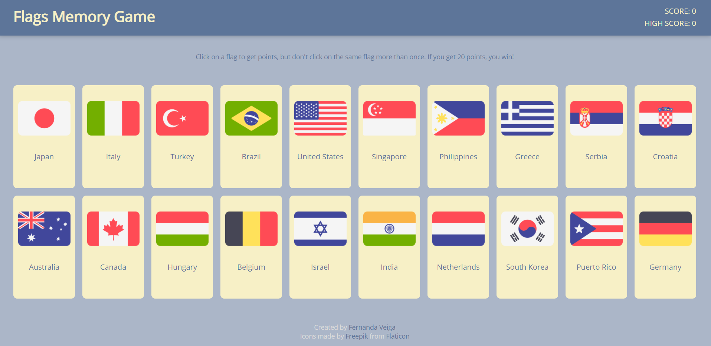

# Memory Game

Project for [TheOdinProject](https://www.theodinproject.com/courses/javascript/) JavaScript curriculum.

The user can play a flag memory game. The user will get points by clicking the flags, but, if a flag is clicked twice, the game is over. The user wins the game if they click all 20 flags without repeating.

## Features

- Score board that stores the user's current score and highest score.

## Resources

- [React](https://reactjs.org/)
- [Webpack](https://webpack.js.org/)
- JavaScript, CSS and HTML
- Icons by [Freepik](https://www.freepik.com) from [Flaticon](https://www.flaticon.com)

## Demo

Live version [here](http://fernanda-veiga.github.io/memory-game)



## How to use

To use the website, click [here](http://fernanda-veiga.github.io/memory-game).

To use the code, download the files and, on the file's directory, type the following on the terminal:

```
npm install
npm run start
```
